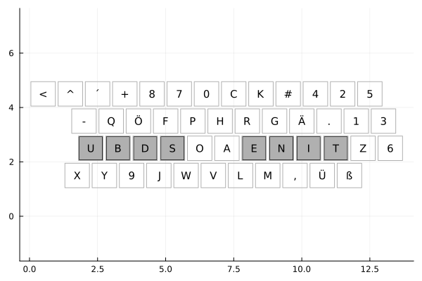

# keyboards

## rewritten in Rust

I think i introduced a bug somewhere that produces bad results. It worked with a previous commit.

Configure the main parameters directly in the [main.rs](src/main.rs) file.
Select your layout with the first generic parameter.
The second ist the number of keys and must match the Layout, otherwise you will get a compiler error.

To adjust the training set update the `training_set_path` in [main.rs](src/main.rs).

Advanced setup can be found in the [advanced_setup.rs](src/advanced_setup.rs) file.

### Comparison

``` julia
temperature = 500
epoch = 20
coolingRate = 0.99
num_iterations = 25000
```

#### julia

> 62.265114 seconds (26.52 M allocations: 1.370 GiB, 0.35% gc time, 1.85% compilation time: 3% of which was recompilation)

#### Rust

> Duration: PT27.854251S

With even more optimizations in the implementation:
> Duration: PT19.896563S

## now with german qwertz support

I added support for the german keys with the QWERTZ layout.
Here is an example layout i got:


original readme:

Supporting simulated annealing code for the [Why I Made The World's Worst Keyboard](https://youtu.be/188fipF-i5I) YouTube video.

Written in Julia... because it's fast, easy to read, and annoys my labmates.

To run, clone the this repository and start Julia with
`julia --project=.` and run `include("keyboardSA.jl")`.
It should start by benchmarking your training data (myBook.txt)
against QWERTY followed by building it's own optimal layout.
Change the number of iterations and cooling rates as
desired within the `data` block at the beginning of the file.
The terminal will give some indication of current progress
(also stored by a new text file will give a iteration-by-iteration record of progress),
and .png files of the current best solution will be saved to your same directory.

To train on your own custom dataset either point the "myBook.txt" somewhere else or just replace its contents.

Good luck!

## more detailed instructions

Download at https://julialang.org/downloads/ and install the Julia language.

Assuming `julia` is in your path, run

```bash
git clone https://github.com/AtomicFrontierCode/keyboards.git
cd keyboards
julia -L 'keyboardSA.jl'
```

If you want to play with the script, it's recommended to use the
[Revise.jl](https://github.com/timholy/Revise.jl) package to minimize latency.
